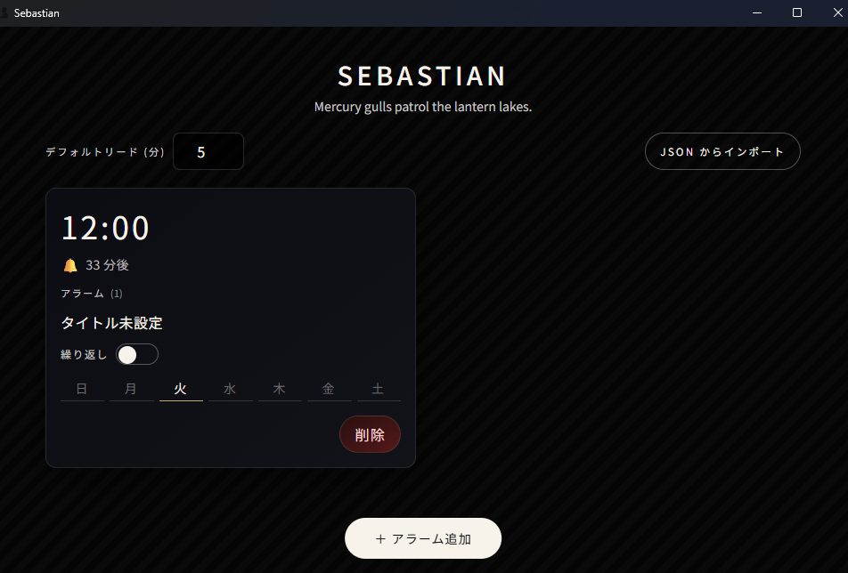
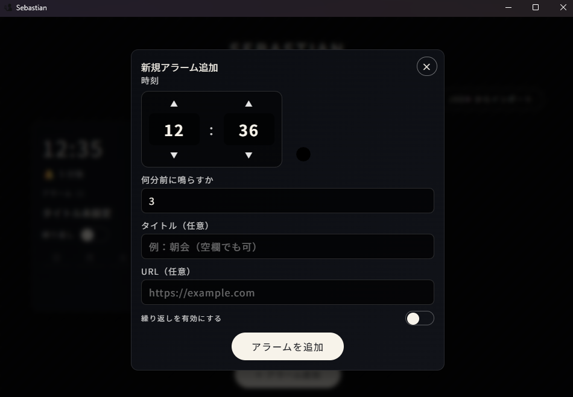

# 🦀 Sebastian




Sebastian は React + TypeScript + Vite で構築した UI と、Tauri + Rust 製の常駐スケジューラを組み合わせたマルチプラットフォーム向けデスクトップアラームです。アプリを閉じてもシステムトレイに常駐し、アラーム時刻になるとウィンドウを最前面に表示して金属質なベル音で通知します。  
_Midnight feathers chase quiet echoes._

## 主な特徴

- Vite + Tailwind ベースの SPA と Tauri 2.0 バックエンドによる軽量で高速なデスクトップ体験。
- 時刻・タイトル・URL・繰り返し曜日・リードタイム（0〜720 分前）を備えた柔軟なアラームの追加 / 編集 / 削除。
- Web Audio API で合成した減衰ベル音とフルスクリーンダイアログで見逃しにくい通知。
- アプリを閉じてもタスクトレイに常駐し、ダブルクリックやメニューから即座に復帰・終了。
- JSON インポートで `alarms.json` 互換データを検証付きで取り込み、既存アラームの置換にも対応。
- `alarms.json` は OS ごとのアプリデータディレクトリへ保存され、再起動後もアラームを維持。
- ツールバーでデフォルトのリードタイム（leadMinutes）を 0〜720 分で設定でき、新規/編集フォームの初期値として反映。
## システム構成

### フロントエンド (Vite + React + TypeScript)

- `src/App.tsx` が全体の状態を管理し、`@tauri-apps/api/core` の `invoke` で Rust コマンドを呼び出し、`@tauri-apps/api/event` の `listen` で `alarm_triggered` を購読します。
- `AlarmList` は `dayjs` を使って相対時間を毎分更新し、URL オープンや削除アクションを提供します。
- `AddAlarmModal` + `AlarmForm` で入力検証（URL の http/https チェック、繰り返し曜日必須、リードタイムのクランプ）を行います。`TimePicker` は独自 UI でキー操作と 24h/60m の循環入力をサポートします。
- `AlarmDialog` はアラーム発火時にタイトル・URL ボタン・停止ボタンを提示し、停止時に `acknowledge_alarm` を呼んで音を止めます。
- `src/styles.css` では Tailwind の `@layer` を使ってコンポーネントスタイルを定義し、フォントや配色を統一しています。

### バックエンド (Tauri + Rust)

- `src-tauri/src/main.rs` が Tauri 2.0 を設定し、`tauri_plugin_opener` を登録、ウィンドウの CloseRequested をフックして非表示化（トレイ残留）します。
- `start_alarm_loop` は `tauri::async_runtime::spawn` + `tokio::time::sleep` で 1 秒おきに `AlarmStore::due_alarms` をチェックし、到来したアラームを `alarm_triggered` イベントとして WebView へ通知します。
- `notify_alarms` は `set_always_on_top(true)` / `show()` / `set_focus()` によって見逃しを防ぎます。
- `alarm_store.rs` では `parking_lot::Mutex` 下で `alarms.json` を読み書きし、`chrono` によりローカルタイムゾーン + `lead_minutes` を考慮した発火時刻を計算します。繰り返しアラームは acknowledging 後に次回発火へ進め、単発アラームは削除します。

### IPC コマンド

| コマンド             | 引数                                                     | 役割                                                                 |
| -------------------- | -------------------------------------------------------- | -------------------------------------------------------------------- |
| `list_alarms`        | なし                                                     | 保存済みアラームを時刻順に返す                                       |
| `create_alarm`       | `payload: NewAlarmPayload`                               | 新規アラームを作成し、最新一覧を返す                                 |
| `delete_alarm`       | `id: string`                                             | 指定アラームを削除                                                   |
| `update_alarm_title` | `id: string, title: string`                              | タイトルのみを即座に更新（将来のインライン編集向け）                 |
| `update_alarm`       | `id: string, payload: NewAlarmPayload`                   | アラームの全フィールドを更新                                         |
| `acknowledge_alarm`  | `id: string`                                             | 鳴動中アラームを停止し、繰り返しなら次回の `next_fire_time` を再計算 |
| `import_alarms`      | `payloads: Vec<NewAlarmPayload>, replace_existing: bool` | JSON から複数のアラームを取り込み、置換モードにも対応                |

`NewAlarmPayload` は `title`, `timeLabel`, `dateLabel?`, `url?`, `repeatEnabled`, `repeatDays`, `leadMinutes` を持ち、UI と Rust (`serde(rename_all = "camelCase")`) で共有されています。`dateLabel` は単発アラーム向けの日付指定（`YYYY-MM-DD`）で、未指定の場合は従来通り「次に来る時刻（今日/明日）」として扱われます。

## 必要環境

- Node.js 18 以上 / npm 9 以上（Vite dev server と Tauri CLI を npm 経由で実行）
- Rust stable (例: 1.80+) と Cargo。`rustup component add rustfmt clippy` を推奨。
- Tauri 2.0 のプラットフォーム依存要件
  - **Windows**: Visual Studio 2022 Build Tools（Desktop development with C++）、WebView2 Runtime。
  - **macOS**: Xcode Command Line Tools、最新 macOS SDK。
  - **Linux**: `libgtk-3`, `libappindicator3`, `openssl` などディストリ依存パッケージ。
- 開発時は WebView でオーディオ再生を許可するため、OS 側でミュートや自動再生制限を解除してください。

## セットアップ & コマンド

### 1. 依存インストール

```bash
npm install
```

### 2. フロントエンドのみで確認

```bash
npm run dev
```

Vite が `http://localhost:5173` で Web UI を提供します。Tauri API との通信は行われないため、バックエンドの代替が必要な箇所（アラーム発火等）は動作しません。

### 3. フルスタック (Tauri) での開発

```bash
npm run tauri:dev
```

Tauri CLI が `npm run dev` を内部で起動し、Rust 側もホットリロードされます。アラーム検知・トレイ常駐などデスクトップ固有挙動を確認する際はこちらを使用します。

### 4. ビルド & プレビュー

```bash
npm run build     # tsc -b + Vite build。dist/ に SPA を出力
npm run preview   # dist/ の内容を実機確認
npm run tauri:build  # src-tauri/target/ 以下にネイティブバイナリやインストーラを生成
```

`tauri.conf.json` の `productName` や `identifier` を変更した場合は再ビルドが必要です。

### 5. Rust サイドの整形とテスト

```bash
cd src-tauri
cargo fmt
cargo test
```

Rust 側の単体テスト（必要に応じて `alarm_store.rs` に追加）とフォーマッタを必ず実行してください。フロントエンドの自動テストはまだ無いため、後述の手動チェックを PR で共有します。

## ディレクトリ概要

```text
.
├─src/                  # Vite + React SPA
│ ├─App.tsx             # 画面エントリ。invoke/listen をまとめる
│ ├─components/         # AlarmList, AlarmDialog, AddAlarmModal など UI 部品
│ ├─types/alarm.ts      # UI と Rust の共有型
│ └─styles.css          # Tailwind ベースのスタイル
├─src-tauri/
│ ├─src/main.rs         # Tauri エントリ・トレイ・イベント登録
│ ├─src/alarm_store.rs  # JSON 永続化とスケジューラ
│ ├─build.rs / Cargo.*  # Rust ビルド設定
│ └─tauri.conf.json     # アプリ/バンドル設定
├─public/               # 静的アセット（アイコン等）
├─package.json
├─tsconfig*.json
└─vite.config.ts
```

## アラームデータと永続化

`AlarmStore` は Tauri の `app_data_dir` 直下に `alarms.json` を保存します。既定の識別子は `com.example.sebastian` なので、OS 別の保存場所は以下の通りです。

| OS      | パス例                                                            |
| ------- | ----------------------------------------------------------------- |
| Windows | `%APPDATA%\com.example.sebastian\alarms.json`                     |
| macOS   | `~/Library/Application Support/com.example.sebastian/alarms.json` |
| Linux   | `~/.local/share/com.example.sebastian/alarms.json`                |

アプリを終了してから編集してください。破損すると読み込みに失敗します。

格納される JSON の一例:

```json
[
  {
    "id": "4fd072bb-e52f-4a70-ba2e-5bf8a8c2cb3c",
    "title": "Daily standup",
    "timeLabel": "09:55",
    "nextFireTime": "2025-11-15T00:52:00+09:00",
    "url": "https://example.com/standup",
    "repeatEnabled": true,
    "repeatDays": ["Mon", "Tue", "Wed", "Thu", "Fri"],
    "leadMinutes": 0
  }
]
```

| フィールド                     | 説明                                                                                          |
| ------------------------------ | --------------------------------------------------------------------------------------------- |
| `timeLabel`                    | 24 時間表記 (HH:mm)。`leadMinutes` 分前に鳴ります。                                          |
| `nextFireTime`                 | ISO 8601。`leadMinutes` 適用後の次回鳴動時刻（ローカルタイムゾーン）。                      |
| `leadMinutes`                  | 0〜720。イベントの何分前に鳴らすか。ツールバーで設定したデフォルト値（初期値は 3 分）がフォームの初期値。 |
| `repeatEnabled` + `repeatDays` | `Mon`〜`Sun`（PascalCase）で曜日を指定。空配列や省略時は単発扱いになり、自動で `repeatEnabled=false` になります。 |
| `url`                          | 任意。`http://` / `https://` のみ保存。                                                       |
| `title`                        | 任意。UI では未入力時に「タイトルを設定」と表示。                                            |

## JSON インポート

同梱の「JSON からインポート」ボタンでは、次のようなデータ形式を貼り付けできます。

- 配列: `[ { ... }, { ... } ]`
- もしくは `{ "alarms": [ ... ] }`

### サンプル（配列）

```json
[
  {
    "title": "Daily standup",
    "timeLabel": "09:55",
    "repeatEnabled": true,
    "repeatDays": ["Mon", "Tue", "Wed", "Thu", "Fri"],
    "leadMinutes": 5,
    "url": "https://example.com/standup"
  },
  {
    "title": "One-off reminder",
    "dateLabel": "2025-02-01",
    "timeLabel": "15:00",
    "repeatEnabled": false,
    "repeatDays": [],
    "leadMinutes": 10
  }
]
```

### サンプル（`alarms.json` オブジェクト）

```json
{
  "alarms": [
    {
      "title": "Weekly sync",
      "timeLabel": "13:30",
      "repeatEnabled": true,
      "repeatDays": "Mon,Thu",
      "leadMinutes": 0
    }
  ],
  "version": 1
}
```

許可されるキーは `camelCase`/`snake_case` 両対応です（例: `timeLabel` / `time_label`）。不足フィールドは検証時にエラーとなり、`leadMinutes` は省略すると 3 に丸められます。「既存のアラームを全て削除してから取り込む」を有効にすると `replace_existing=true` で `AlarmStore` を初期化します。取り込み後は一覧が直ちに再読み込みされます。`repeatDays` を省略または空配列にした場合は単発アラームとして扱われ、自動で `repeatEnabled=false` になります。文字列・配列で渡した曜日は `Mon`〜`Sun` のうち有効なものだけが採用されます。
`dateLabel`（`YYYY-MM-DD`）を指定すると単発アラームを指定日で作成できます（`snake_case` は `date_label`）。

## アラーム動作

1. 追加/更新時に Rust 側で `chrono` を使って次回発火時刻を計算し、`alarms.json` を保存します。
2. バックグラウンドループが 1 秒ごとに現在時刻と `next_fire_time` を比較し、該当アラームを `ringing` セットに登録。
3. フロントエンドは `alarm_triggered` を受け取ると `AlarmDialog` を表示し、Web Audio API で 4 つの部分音からなるベル音（減衰 envelope 付き）を再生します。
4. `停止` を押すと `acknowledge_alarm` を呼び、繰り返しアラームは次の曜日へローテーション、単発アラームは削除・サウンド停止後に `set_always_on_top(false)` で通常状態へ戻ります。
5. URL が設定されている場合は `@tauri-apps/plugin-opener` で既定ブラウザを開きます。
6. ウィンドウ右上の × は終了ではなく非表示です。完全終了するにはタスクトレイの「終了」メニューを使います（ダブルクリックで「表示」）。

## コントリビューション指針

- 2 スペースインデント、React コンポーネントは PascalCase、フック/ユーティリティは camelCase、CSS クラスは `kebab-case`。
- すべての `invoke` 呼び出しにエラーハンドリングを残してください（UI では `error-text` を表示）。
- Rust コードは `cargo fmt`、TypeScript はエディタの Prettier で整形します。
- PR では最低限 `npm run build`, `npm run tauri:build`（必要な場合）, `cd src-tauri && cargo test` を実行し、結果を記載してください。
- `alarms.json` のスキーマを変更する場合は後方互換を保ち、README と PR で必ず告知します。
- 自動テストが無い箇所は手動テスト結果（以下参照）を PR 説明に添付してください。

## 手動テストチェックリスト

1. `npm run tauri:dev` で起動し、単発・繰り返しのアラームを新規作成できること。
2. 単発アラームで日付を指定した場合、その日時で鳴動すること（過去日時はエラーになること）。
3. URL 付きアラームで「リンクを開く」ボタンが既定ブラウザを開くこと。
4. 繰り返し ON + 曜日複数選択時に UI/保存共に正しく反映され、曜日未選択時は送信できないこと。
5. `leadMinutes` を 0 や 720 など境界値にしても保存され、`AlarmList` で相対時刻が更新されること。
6. アラームを現在時刻から数分後に設定して鳴動を確認し、停止で音と最前面化が解除されること。
7. JSON インポート（置換モード ON/OFF 両方）で期待通りに一覧が更新されること。
8. ウィンドウを閉じてもトレイに残り、ダブルクリックで復帰 / メニュー「終了」で完全終了できること。
9. 削除ボタンでアラームが即座に消えること。

## トラブルシューティング

- **ベル音が鳴らない**: 初回はブラウザ/OS の自動再生制限が効く場合があります。何らかの UI 操作（ボタン押下）後にもう一度鳴動させてください。また、システム音量と WebView2 の音量を確認します。
- **アラームが発火しない / 遅れる**: PC がスリープ中はループが停止します。重要なアラームはスリープを無効にするか、十分な `leadMinutes` を確保してください。OS 時刻のずれも確認します。
- **`npm run tauri:dev` でビルド失敗**: Tauri のネイティブ依存（Visual Studio Build Tools や `libgtk-3` 等）が不足していないか確認してください。エラーメッセージに従って再インストールします。
- **ポート 5173 が使用中**: `VITE_PORT=5174 npm run dev` など環境変数でポートを変更し、`tauri.conf.json` の `devUrl` も合わせて更新します。
- **設定をリセットしたい**: アプリ終了後に上記ディレクトリの `alarms.json` を削除すると初期状態に戻せます（バックアップ推奨）。

## ライセンス

本プロジェクトは [MIT License](./LICENSE) の下で公開されています。
